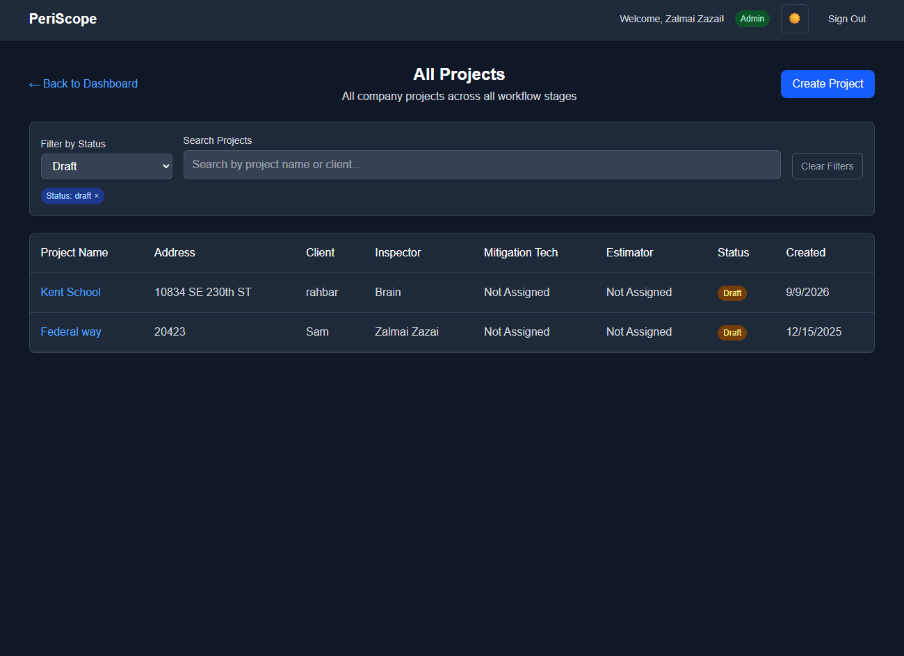
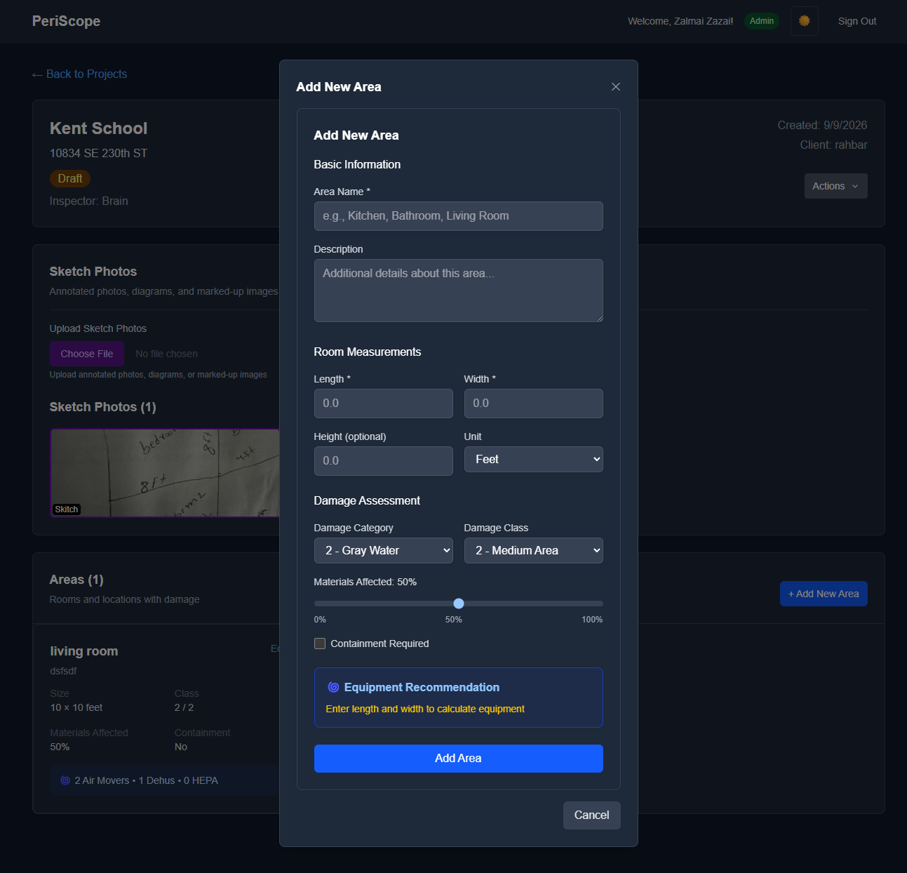
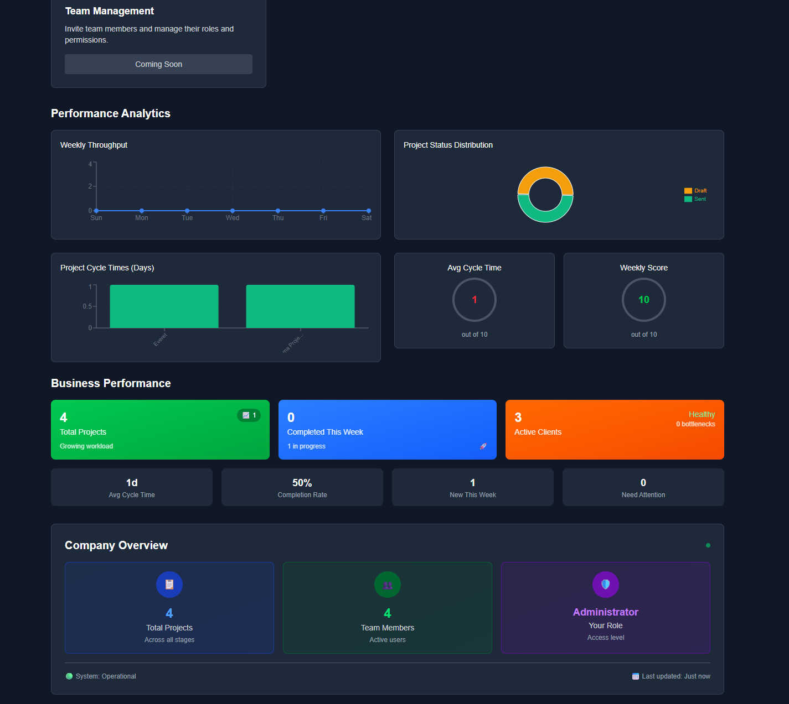

# Periscope — Restoration Project Management & Estimation Platform

> A full-stack SaaS platform designed to digitize the paper-based workflow used by property restoration companies — from initial inspection and measurement to estimation, mitigation, reporting, and project completion.

[](#)
[](#)
[](#)
[](#)
[](#)

**Live Demo:** `https://periscope-iota.vercel.app/`

---

## 📸 Screenshots

> Replace the placeholders below with screenshots from the deployed application.

| Dashboard                            | Project Management                 |
| ------------------------------------ | ---------------------------------- |
|  |  |

| AI Property Sketch                     | Inspection & Line Items                |
| -------------------------------------- | -------------------------------------- |
|  |  |

| Estimation Workflow                    | KPI Dashboard              |
| -------------------------------------- | -------------------------- |
|  |  |

---

## 🚀 Overview

Periscope is a restoration-industry SaaS application built to replace fragmented, paper-based project workflows with a centralized digital platform.

Restoration companies can use Periscope to:

- Create and manage restoration projects
- Organize users by role and company
- Assign projects to the appropriate team members
- Perform digital property inspections
- Process thousands of restoration line items
- Use AI to analyze property sketches and generate room measurements
- Generate AI-assisted explanations for required line items
- Move projects through inspection → estimation → mitigation → final estimation
- Track project progress through KPIs
- Generate structured reports compatible with Xactimate workflows

The application was designed around the real workflow of a restoration company rather than as a generic project-management tool.

---

# 🏗️ Core Workflow

```text
                    ┌─────────────────────┐
                    │   Create Project    │
                    └──────────┬──────────┘
                               │
                               ▼
                    ┌─────────────────────┐
                    │     Inspection      │
                    │  Measurements +    │
                    │    Line Items       │
                    └──────────┬──────────┘
                               │
                               ▼
                    ┌─────────────────────┐
                    │      Estimator      │
                    │ Review + Estimation │
                    └──────────┬──────────┘
                               │
                               ▼
                    ┌─────────────────────┐
                    │   Mitigation Tech   │
                    │ Physical Work +     │
                    │ Remove/Modify Items │
                    └──────────┬──────────┘
                               │
                               ▼
                    ┌─────────────────────┐
                    │      Estimator      │
                    │ Final Review +      │
                    │     Estimation      │
                    └──────────┬──────────┘
                               │
                               ▼
                    ┌─────────────────────┐
                    │ Project Completion  │
                    │ Reports / Export    │
                    └─────────────────────┘
```

---

# ✨ Key Features

## 1. Multi-Company SaaS Architecture

Users can either:

- Create a new restoration company
- Join an existing company
- Access only the projects and data associated with their organization and permissions

This provides a foundation for a multi-tenant SaaS architecture with company-level data isolation.

---

## 2. Role-Based User Management

Periscope supports different operational roles and permissions.

### Administrator

Administrators can:

- Create and manage projects
- Add and manage users
- Assign roles
- Control project access
- Change project status
- Manage company-level information
- Monitor project progress

### Inspector

Inspectors can:

- Perform property inspections
- Add rooms and measurements
- Add restoration line items
- Specify quantities
- Generate AI-assisted item explanations
- Submit completed inspections to estimators

### Estimator

Estimators can:

- Review inspection data
- Review and modify line items
- Adjust quantities
- Create and modify estimates
- Review mitigation changes
- Complete final project estimation
- Generate project reports

### Mitigation Technician

Mitigation technicians can:

- Review assigned project information
- Perform physical mitigation work
- Remove unnecessary line items
- Modify quantities based on actual work performed
- Submit updated project information back to the estimator

---

# 🤖 AI-Powered Property Sketch Analysis

One of the core features of Periscope is the AI-assisted property measurement workflow.

Instead of manually calculating measurements from a hand-drawn property sketch, an inspector can provide a sketch containing information such as:

```text
Bedroom 1
Height: 10 ft
Width: 12 ft

Kitchen
Height: 10 ft
Width: 15 ft

Bathroom
Height: 9 ft
Width: 8 ft
```

The application sends the sketch to an OpenAI model for analysis.

The AI identifies:

- Rooms
- Room names
- Dimensions
- Property areas
- Relevant measurements

The application then converts the extracted information into structured project data that can be used for calculations and reporting.

### Example

```text
Hand-drawn sketch
       ↓
   OpenAI Vision
       ↓
Room identification
       ↓
Dimension extraction
       ↓
Structured project data
       ↓
Area / measurement calculations
       ↓
Project inspection data
```

This significantly reduces manual data entry and helps inspectors move measurements from paper sketches into the digital project workflow.

---

# 📋 Restoration Line Item Management

Periscope includes a large restoration line-item library containing **5,000+ items**.

The line-item data can be imported from source PDF documentation and transformed into structured application data.

Inspectors can:

1. Search/select an item
2. Add it to a project
3. Enter the required quantity
4. Generate an AI-assisted explanation
5. Submit the inspection for estimation

---

# 🧠 AI-Assisted Line Item Reasoning

For each selected restoration item, Periscope can use AI to generate an explanation describing:

- Why the item may be required
- How it relates to the inspection
- Why the quantity is appropriate
- The context in which the item would be used

### Example

```text
Line Item:
Air Scrubber

Quantity:
2

AI Usage Explanation:
Two air scrubbers are recommended based on the affected
area and the need for air filtration during the mitigation
process.
```

This gives inspectors and estimators a consistent way to document the reasoning behind project items.

---

# 📊 KPI & Project Progress Tracking

Periscope includes KPI dashboards that allow restoration companies to monitor project progress.

KPIs can represent different stages of the workflow, including:

- Inspection progress
- Estimation progress
- Mitigation progress
- Final estimation
- Project completion

Project-level status and KPI information provide management with a quick overview of where each project stands.

---

# 📄 Reporting & Xactimate Workflow

After the project moves through inspection, estimation, and mitigation, Periscope can generate structured reports designed to support **Xactimate-compatible restoration estimating workflows**.

The reporting workflow consolidates:

- Property measurements
- Rooms
- Line items
- Quantities
- Inspection information
- Estimator changes
- Mitigation changes
- Final project data

This reduces the need to manually reconstruct project information from paper documents.

---

# 🔐 Access Control

The application uses role-based access to control what users can see and modify.

A simplified permission model:

| Role            | Projects | Inspection | Estimation | Mitigation | Admin |
| --------------- | -------: | ---------: | ---------: | ---------: | ----: |
| Admin           |       ✅ |         ✅ |         ✅ |         ✅ |    ✅ |
| Inspector       | Assigned |         ✅ |       View |       View |    ❌ |
| Estimator       | Assigned |       View |         ✅ |       View |    ❌ |
| Mitigation Tech | Assigned |       View |       View |         ✅ |    ❌ |

Users see projects relevant to their company and assigned project access.

---

# 🧩 Technical Architecture

```text
                         ┌────────────────────┐
                         │      Browser       │
                         │ React / Next.js UI │
                         └─────────┬──────────┘
                                   │
                                   ▼
                         ┌────────────────────┐
                         │   Next.js App      │
                         │ Server + API Logic │
                         └───────┬─────┬──────┘
                                 │     │
                    ┌────────────┘     └──────────────┐
                    ▼                                 ▼
          ┌──────────────────┐              ┌─────────────────┐
          │     MongoDB      │              │     OpenAI      │
          │ Projects / Users │              │ Vision + AI     │
          │ Line Items / KPI │              │ Explanations    │
          └──────────────────┘              └─────────────────┘
```

---

# 🛠️ Technology Stack

### Frontend

- **Next.js**
- **React**
- **TypeScript**
- **Tailwind CSS**

### Backend

- **Next.js API / server-side functionality**
- **MongoDB**
- **Mongoose**

### AI

- **OpenAI API**
- Vision-based property sketch analysis
- AI-assisted restoration line-item reasoning

### Data & Application Features

- Role-based authorization
- Multi-company architecture
- Project lifecycle management
- KPI tracking
- PDF-based data processing
- Structured report generation
- Xactimate-oriented export/reporting workflow

---

# 📁 Suggested Project Structure

```text
periscope/
├── app/
│   ├── dashboard/
│   ├── projects/
│   ├── users/
│   ├── inspection/
│   ├── estimation/
│   ├── mitigation/
│   ├── reports/
│   └── api/
│
├── components/
│   ├── dashboard/
│   ├── projects/
│   ├── inspection/
│   ├── estimation/
│   └── shared/
│
├── models/
│   ├── User.ts
│   ├── Company.ts
│   ├── Project.ts
│   ├── LineItem.ts
│   └── Inspection.ts
│
├── lib/
│   ├── mongodb.ts
│   ├── openai.ts
│   └── authorization.ts
│
├── public/
│   └── screenshots/
│
└── README.md
```

---

# 🔄 Example Project Lifecycle

### Step 1 — Project Creation

An administrator creates a new restoration project and assigns the appropriate team members.

### Step 2 — Inspection

The inspector enters property information, measurements, and restoration requirements.

### Step 3 — AI Measurement

The inspector provides a property sketch. OpenAI analyzes the sketch and extracts rooms and dimensions.

### Step 4 — Line Items

The inspector selects restoration items from the 5,000+ item library and enters quantities.

### Step 5 — AI Explanation

Periscope generates an explanation for why each selected item is relevant to the project.

### Step 6 — Estimation

The estimator reviews the inspection and makes the required changes.

### Step 7 — Mitigation

The mitigation technician performs the physical work and updates the project based on what was actually required.

### Step 8 — Final Estimation

The estimator reviews the technician's changes, adjusts the estimate, and completes the project.

### Step 9 — Reporting

The completed project can be converted into structured reports for the restoration company's workflow.

---

# 💡 Problems Solved

Traditional restoration workflows can involve:

- Paper inspection forms
- Handwritten measurements
- Manual calculations
- Large PDF reference documents
- Repeated data entry
- Communication gaps between inspectors and estimators
- Difficult project tracking
- Manual report preparation

Periscope centralizes these workflows into a single application and uses AI where it can reduce repetitive manual work.

---

# 🎯 Engineering Highlights

This project demonstrates experience with:

- Full-stack SaaS application development
- Next.js application architecture
- TypeScript
- MongoDB data modeling
- Role-based access control
- Multi-tenant company architecture
- Complex project state management
- AI API integration
- Vision-based AI workflows
- PDF-to-structured-data processing
- Large-scale line-item search and selection
- KPI dashboards
- Workflow automation
- Report generation
- Real-world client requirements and iterative feature development

---

# 🔒 Demo & Security

The production application contains business and project information belonging to restoration companies. For that reason, production credentials and private customer data should not be included in this repository.

For portfolio demonstrations, use:

- Sanitized sample projects
- Mock company data
- Demo accounts
- Redacted screenshots

**Live Demo:** `https://periscope-iota.vercel.app/`

---

# 📬 Contact

**Developer:** Zalmai Zazai

Built as a production-oriented restoration technology platform to modernize inspection, estimation, mitigation, and reporting workflows.
